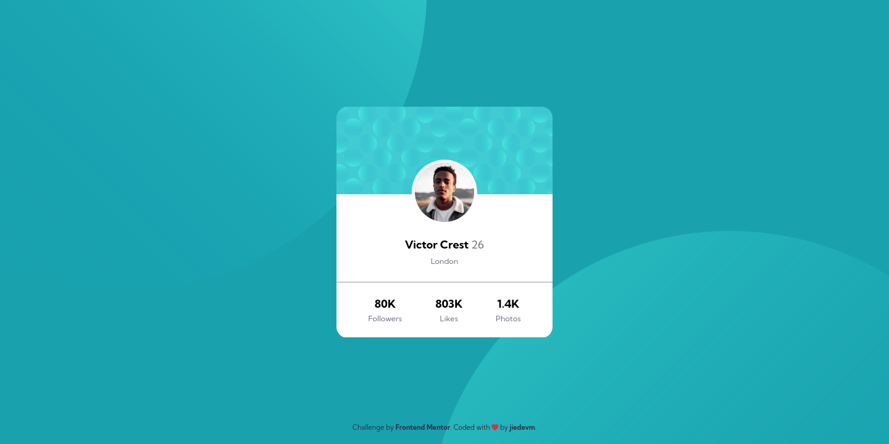

# Frontend Mentor - Profile card component solution

This is a solution to the [Profile card component challenge on Frontend Mentor](https://www.frontendmentor.io/challenges/profile-card-component-cfArpWshJ). Frontend Mentor challenges help you improve your coding skills by building realistic projects. 

## Table of contents

- [Frontend Mentor - Profile card component solution](#frontend-mentor---profile-card-component-solution)
  - [Table of contents](#table-of-contents)
  - [Overview](#overview)
    - [The challenge](#the-challenge)
    - [Screenshot](#screenshot)
    - [Links](#links)
  - [My process](#my-process)
    - [Built with](#built-with)
    - [What I learned](#what-i-learned)
  - [Author](#author)

## Overview

### The challenge

- Build out the project to the designs provided

### Screenshot



### Links

- Solution URL: [https://github.com/dieudonneallognon/profile-card-component](https://github.com/dieudonneallognon/profile-card-component)
- Live Site URL: [https://dieudonneallognon.github.io/profile-card-component/](https://dieudonneallognon.github.io/profile-card-component/)
## My process

### Built with

- Semantic HTML5 markup
- Flexbox
- CSS Grid
- Mobile-first workflow
- Less

### What I learned

This project helped me to understand more about background image positioning properties.

```css
html {

  &::before,
  &::after {
      position: absolute;
      content: "";

      width: inherit;
      height: inherit;
      max-width: inherit;
      min-width: inherit;
      background-repeat: no-repeat;
      z-index: -1;
  }

  &::before {
      background-image: url("./images/bg-pattern-top.svg");
      background-position-y: -28.7rem;
      background-position-x: -45.2rem;
  }

  &::after {
      background-image: url("./images/bg-pattern-bottom.svg");
      top: 0;
      background-position-x: 8.7rem;
      background-position-y: 21rem;
  }

  ...
}

@media (min-width: 376px) {
    html {
        &::before {
            background-position-y: -28rem;
            background-position-x: -16rem;
        }

        &::after {
            top: 0;
            background-position-x: 38.5rem;
            background-position-y: 20.8rem;
        }
    }
}
```

## Author

- Github - [dieudonneallognon](https://github.com/dieudonneallognon)
- LinkedIn - [Dieudonné Allognon](https://www.linkedin.com/in/dieudonn%C3%A9-allognon-200239175/)
- Frontend Mentor - [@dieudonneallognon](https://www.frontendmentor.io/profile/dieudonneallognon)
- Twitter - [@JieDevM](https://twitter.com/JieDevM)
